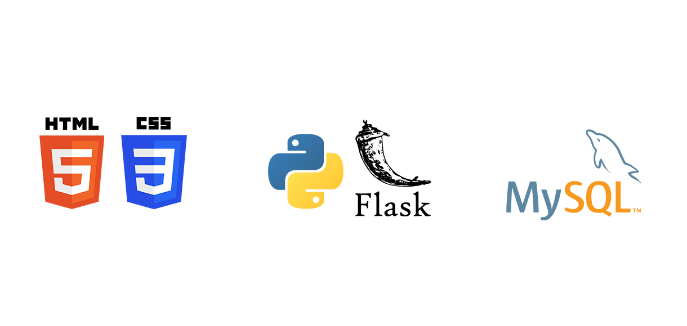

<span id="topo"></span>
<h1 align="center">FATEC Prof Jessen Vidal, São José dos Campos - 1º Semestre DSM 2022</h1>
<p align="center">
    <a href="#sobre">Sobre</a> | 
    <a href="#entregas">Entregas</a> | 
    <a href="#backlogs">Backlogs</a> |  
    <a href="#tecnologias">Tecnologias</a> | 
    <a href="#equipe">Equipe</a> | 
</p>
<span id="sobre"></span>

<h2> Sobre o projeto </h2>
Projeto desenvolvido por alunos do 1º semestre do curso de Desenvolviento de Software Multiplatafora, da FATEC Prof Jessen Vidal em São José dos Campos. <br> Consiste na criação de um sistema de Internet Banking capaz de gerenciar operações bancárias simples, como depósito, saque e transferência entre usuários. Back-end do projeto desenvolvido em python utilizando o microframework flask e o MySQL para gerenciar o banco de dados.
>Status do projeto: Em desenvolvimento :hourglass:

## Como executar a aplicação
* Tenha o Python e o MySQL instalados. <br>
* Clone o repositório. <br>
* No terminal:
```powershell
# Acesse a página do projeto
cd projeto

# Instale as dependências
pip install -r requirements.txt
``` 
<p>Utilize dos arquivos script .sql para criar a estrutura do banco de dados</p>

```powershell
# Configure as informações do banco de dados de acordo com o seu servidor nos arquivos app.py e modelo.py 
app.config['MYSQL_HOST'] = '' # localhost
app.config['MYSQL_USER'] = '' # Usuário 
app.config['MYSQL_PASSWORD'] = '' # Senha 
app.config['MYSQL_DB'] = '' # Nome do banco de dados
app.config['MYSQL_CURSORCLASS'] = 'DictCursor'
```
* Execute a aplicação

<span id="entregas"></span>

## Entregas
O projeto está sendo realizado utilizando-se da metodologia ágil SCRUM, separadas em 4 entregas com sprints de 21 dias de duração cada uma. <br>

| Sprint| Período | Status | Relatório |
|:-----:|:----------:|:---------:|:---------:|
| 01 |   29/08/2022 - 19/09/2022 | Entregue :heavy_check_mark: | [relatório](docs/entregas/sprint-1/README.md) |
| 02 |   18/04/2021 | Pendente :hourglass:|  |
| 03 |   16/05/2021 | Pendente :hourglass:|  |
| 04 |   06/06/2021 | Pendente :hourglass:|  |

<span id="backlogs"></span>

## Backlogs
### Backlog do produto

### Backlog das sprints
#### Sprint 1
| Item | Funcionalidade                  |
| :--: | :------------------------- |
|  01  | Organização dos Requisitos|
|  02  | Protótipos Visuais |
|  03  | Front-end do site|
|  04  | Cadastro e Login de usuários (Abertura de conta) |
|  05  | Operações de depósito e saque |

<span id="tecnologias"></span>

## Tecnologias utilizadas


<span id="equipe"></span>

## Equipe
|    Função    | Nome                     |                     GitHub                     |
| :----------: | :----------------------- | :--------------------------------------------: |
| Product Owner | Renan Souza Neves | [Github](https://github.com/Renan-Neves)
| Scrum Master | Vinicius de Oliveira Laranjeiro | [GitHub](https://github.com/noo-e) |
|   Dev Team   | Bruno Denardo |    [GitHub](https://github.com/brunodenardo)    |
|   Dev Team   | Juan Santos do Vale| [GitHub](https://github.com/JuanSantosVale)      |
|   Dev Team   | Matheus Fernando Vieira de Melo  |  [GitHub](https://github.com/Matheusfvm)       |
|   Dev Team   | Murilo Henrique Sangi da Silva Lima | [GitHub](https://github.com/MuriloLima03) |
|   Dev Team   | Samuel Lucas Vieira de Melo |   [GitHub](https://github.com/SamuelLucasVieira)    |

