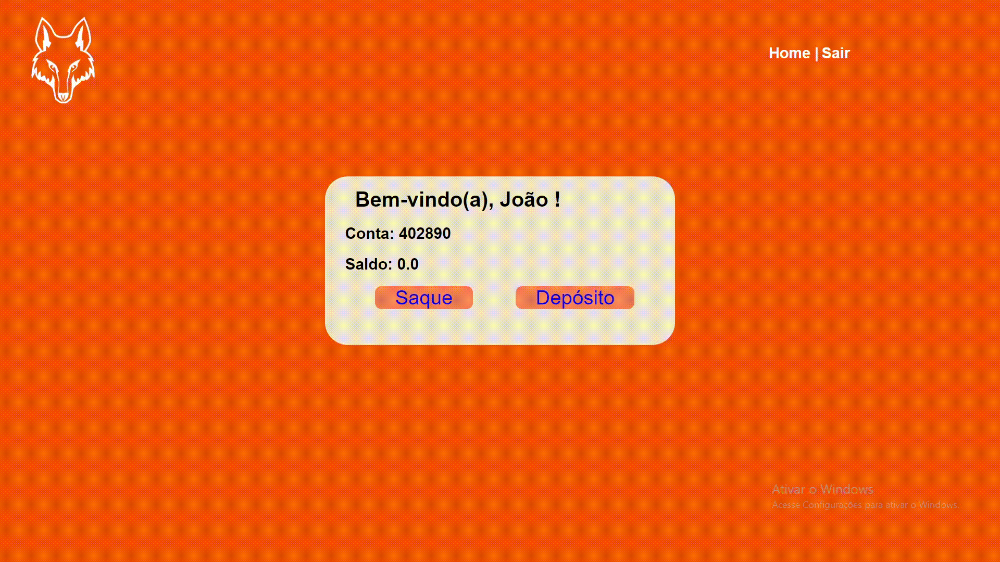

# Relatório da Sprint 1
**Duração: 29/08/2022 - 19/09/2022**
## Organização dos requisitos
Tendo em vista que os requisitos para o produto foram expostos pelo cliente em detalhes na apresentação do projeto, a atenção da equipe se voltou a entender quais desses representariam mais valor para a primeira entrega e os respectivos detalhes de cada um. Em reunião com o cliente, chegamos ao acordo dos seguintes requisitos:
* <a href="prototipo">Protótipos visuais</a>
* <a href="cadastro-login">Abertura de contas</a>
* <a href="operacoes">Operações de saque e depósito</a>

<h2 id="prototipo">Protótipos visuais</h2>
A prototipação da parte visual do nosso site foi realizada inicialmente na ferramenta <a href="https://www.figma.com/">Figma</a>. Ela serviria de base para o cliente entender a nossa visão do produto, bem como as formas que a equipe pensou em arquitetar as informações para alinhar as expectativas com aquilo que estava sendo desenvolvido. Nossa equipe produziu algumas telas para suprir as funcionalidades que construímos. 

> * **Durante o processo de transformar as imagens em arquivos HTML e CSS, algumas alterações visuais foram feitas**

<h2 id="cadastro-login">Cadastro e Login de usuários</h2>
O back-end do nosso projeto foi desenvolvido em Python utilizando o microframework Flask em conjunto do SGBD MySQL. Para possibilitar a criação de conta por parte dos usuários foi necessário descobrir um método de capturar as informações inseridas por ele e armazená-las nos esquemas do nosso banco de dados. Nós fizemos isso utilizando um método do Flask chamado flask_mysqldb.
Assim que as informações são cadastradas, é gerado para o usuário um número aleatório (e único) de conta que é utilizado para acessar a conta. 

 
Na parte de login, nosso código consulta as tabelas do banco de dados para confirmar se os campos preenchidos coincidem com os cadastrados, caso contrário uma mensagem de erro é informada.

<h2 id="operacoes">Operações de Saque e Depósito</h2>
Uma vez cadastrado, um usuário pode realizar as operações básicas de saque e depósito para sua conta, exibindo sempre o saldo atualizado na sua tela principal. O código rercebe a quantia digitada, realiza as operações (soma ou subtração) junto ao saldo atual e atualiza o valor n banco de dados.
